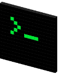

# Personal Website
My personal website, currerntly hosted at `http://cgi.cs.mcgill.ca/~hsalee/`.

Made using SkeletonCSS. Get it here `http://getskeleton.com/`

### To Do 

Before :ship:

- [ ] Update the list of Publications.
- [ ] Update the CV.
- [ ] Add more detailed About Me.
- [ ] Add more details on research projects.
- [ ] Add abstracts, gist and results from publications.
- [ ] Add the twitter json as blog post.
- [ ] Write the blog post on Reddit2Vec.
- [ ] Add stuff on tool repos.
- [ ] Add content to cool-stuff.

Note: 
* All files should be `644` & all directories should be `755`.
* Run `chmod -R 755 *`
* Run `find . -type f -exec chmod 644 {} +`
